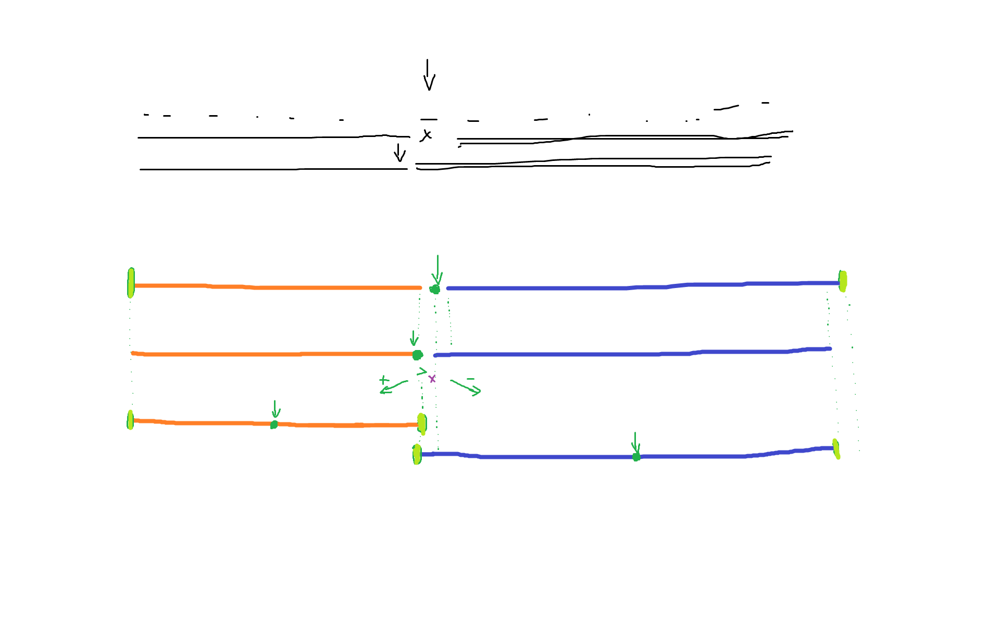
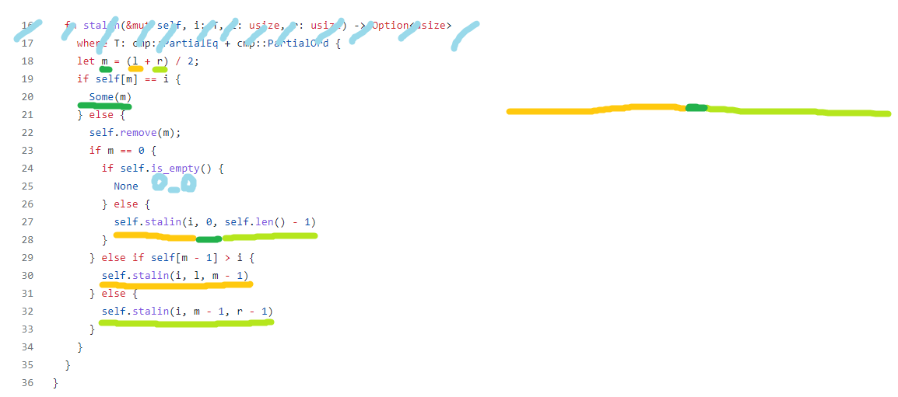

# Complexity analysis of the algorithm

## October 13th version
It is a bit of a complicated task at this point to make decision on what is more impressive: the the efficiency of the algorithm or it's poor analysis.  
I guess, it's a reason good enough to make an attempt to fix both.

---
### The algorithm explanation

The logic is not as sophisticated as it might first seem due to writer's unbearable stylistic choices.  
Everything boils to these main steps:
1. Find the middle element and check it with the searched one. We found one? The job is done.
2. Not lucky enough? Remove the ***middle*** element. Simply eliminate it.
3. The next step (as one could see by the source) is not really the "next" but rather a rare occasion so we'll leave it alone for a moment.
4. Now we do another comparison of the searched element against the one to the **left** to the ***one we've just eliminated***. As the elements are in total sequential disorder, it's basically a roll of a dice. There's not much to predict of a last roll. But now we have 2 paths based on it:
    - either we recurse into the left part of an array => (l <=> m - 1) 
    - or we recurse into the **kinda-right-part** of an array but **not quite**, as we join the ***m - 1***th element in both scenarios => (m - 1, r - 1)
5. Just in case we've come too close to the left edge of an array, there is an additional check (see 3). Should this happen, the recursion pointers are refreshed with the arrays' edges. This saves the recursion from being indefinitely stuck.

Let's sum up:
- Each step 1 element is being checked for the fact of being the searched one. If it's not, it's getting eliminated.
- We got a tottally random roll of a dice aftewards which decides whether we go left or right following.
- The middle element number is discrete which means, in case of edge pointers being **n** and **n + 1** the middle element is always gonna be equal to **n**.
- The elimination of **n** yields, in turn, the shift of this tiny group of 2 by 1 left.
- In case the sought was not in the left part of an array prior to this 1-step-shift deadlock, at some point we eliminate the whole left part and the pointers are refreshed to match the whole array scope once again.

These basics lead us to an extremely straightforward analysis:
1. The worst running time is ~N since there's no way to avoid the checking procedure for every element in an unsorted array.
2. The best running time is ~1 as we have a chance of getting the right element immediately.
3. The average running time on an evenly distributed array and a comparably random sought number consists of:
    - Having *~0%* chance to find it on a first run to the **(n <=> n + 1)** deadlock, *~(log N)* steps. 
    - Then we do get to make *N/2 ~ N* steps to trim the left part of an array.
    - And after that we roll the dise once again, being left with the same *~50%* chance to find it in *~log(N)* steps before having to trim *N/4* elements of the left part once again. 

    Which leads us to *~N* running time on an average case roughly. Further analysis is not that useful and could be obtained by large-scale simulations rather easily.
4. Since the average successive (the element is present in an array) run takes *~N* steps, there is a probabilistic guarantee for a *~1* running time essentially after the ***very first run***.

### Safety
*not ready yet but there are quite dangerous bugs*

### Practical research
The experiments can easily be modeled with [this tool](https://yanefingon.github.io/Mawa-Search-Algorithm-Visualization/). It is strongly advised to create **arbitrary** arrays of random length for conclusive testing.